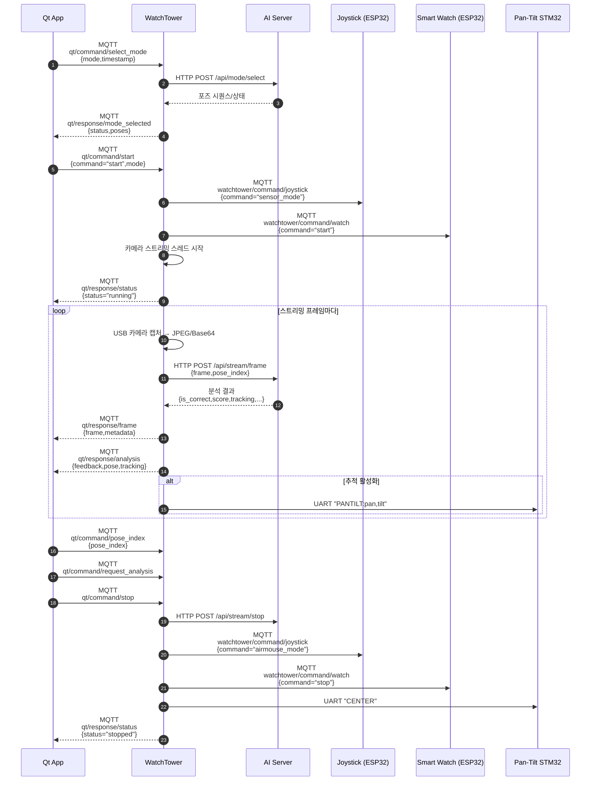

# 시스템 통신 프로토콜 요약

## 구성 요소와 역할
- `WatchTower` – 중앙 오케스트레이터로 MQTT, HTTP, UART를 묶어 Qt 클라이언트·디바이스·AI 서버 사이의 트래픽을 중계한다 (참조: WatchTower/watchtower_main.py:41).
- `Qt_app_v3` – 사용자 UI이자 MQTT 클라이언트로 운동 모드/제어 명령을 발행하고 실시간 영상·분석·센서 데이터를 수신한다 (참조: Qt_app_v3/mainwindow.cpp:440).
- `ai_server_v3` – Flask 기반 포즈 분석 서버로 WatchTower가 호출하는 REST 엔드포인트를 제공한다 (참조: ai_server_v3/ai_server.py:19).
- `joysitck` – ESP32-C3 조이스틱 펌웨어로 WatchTower 명령을 MQTT로 받아 자세 센서값·에어마우스 입력을 발행한다 (참조: joysitck/main/mqtt_handler.c:33).
- `smart_watch` – ESP32 워치 펌웨어로 심박수 측정과 상태 보고를 담당한다 (참조: smart_watch/main/watch_mqtt_client.c:1).
- `pan-Tilt-cam` – STM32 기반 팬틸트 모듈로 UART 명령을 해석해 서보를 구동한다 (참조: pan-Tilt-cam/Core/Src/main.c:151).

모든 MQTT 토픽과 네트워크 주소는 `WatchTower/watchtower_config.py`와 `Qt_app_v3/config.cpp`에서 기본값을 정의하며 필요 시 현장 환경에 맞게 수정한다 (참조: WatchTower/watchtower_config.py:13, Qt_app_v3/config.cpp:24).

---

## MQTT: Qt 앱 ↔ WatchTower
### 토픽 개요
- Qt → WatchTower 명령: `qt/command/select_mode`, `qt/command/start`, `qt/command/stop`, `qt/command/pose_index`, `qt/command/request_analysis` (참조: WatchTower/watchtower_config.py:40).
- WatchTower → Qt 응답: `qt/response/mode_selected`, `qt/response/error`, `qt/response/status`, `qt/response/analysis`, `qt/response/frame`, `qt/response/joystick`, `qt/response/watch` (참조: WatchTower/watchtower_config.py:45).
- Qt는 기본적으로 `qt/response/#`를 구독하며, 각 토픽을 유형별 핸들러로 분기한다 (참조: Qt_app_v3/config.cpp:40, Qt_app_v3/mainwindow.cpp:579).

### 핵심 시나리오
1. **운동 모드 선택**
   1. Qt가 `{"mode":"<영문 모드>","timestamp":<epoch_sec>}`를 `qt/command/select_mode`로 발행한다 (참조: Qt_app_v3/mainwindow.cpp:1093).
   2. WatchTower는 메시지를 받아 AI 서버에 `/api/mode/select`를 호출하고 포즈 시퀀스를 캐시한 뒤 `qt/response/mode_selected`로 결과와 `poses` 배열을 돌려준다 (참조: WatchTower/watchtower_main.py:94, WatchTower/http_client.py:58, WatchTower/mqtt_controller.py:644, ai_server_v3/ai_server.py:62).
   3. 조이스틱은 계속 에어마우스 모드를 유지하고, Qt는 알림을 받은 뒤 사용자에게 “시작” 버튼을 누르게 한다.

2. **운동 시작**
   1. Qt가 `{"command":"start","mode":"…","timestamp":…}`를 `qt/command/start`로 발행한다. (Qt는 더 이상 조이스틱 모드를 직접 바꾸지 않는다.) (참조: Qt_app_v3/mainwindow.cpp:440)
   2. WatchTower는 조이스틱을 `sensor` 모드로 전환하고, 조이스틱·워치에 시작 명령을 브로드캐스트한 뒤 카메라 스트리밍 스레드를 기동한다 (참조: WatchTower/mqtt_controller.py:424, WatchTower/watchtower_main.py:153).
   3. 스트리밍 루프가 시작되면 매 프레임을 JPEG→Base64 인코딩하여 `qt/response/frame`으로 송신하고, 분석 요청이 활성화된 경우 AI 서버 `/api/stream/frame`으로 전달한 응답을 `qt/response/analysis`에 그대로 중계한다 (참조: WatchTower/watchtower_main.py:389, WatchTower/mqtt_controller.py:736, WatchTower/mqtt_controller.py:713).
   4. 첫 번째 분석 결과를 받으면 팬틸트 추적을 켜고 필요 시 UART 명령을 STM32로 전송한다 (참조: WatchTower/watchtower_main.py:417).
   5. 운동이 정상적으로 시작되면 `qt/response/status` 토픽으로 `{"status":"running"}` 메시지를 보낸다 (참조: WatchTower/watchtower_main.py:179).

3. **운동 중 제어**
   - Qt는 포즈 전환 시 `{"mode":"…","pose_index":n,"timestamp":…}`를 `qt/command/pose_index`로 전송하며, 필요할 때 `qt/command/request_analysis`로 단발성 분석을 요청한다 (참조: Qt_app_v3/mainwindow.cpp:1002, Qt_app_v3/mainwindow.cpp:1045).
   - WatchTower는 현재 포즈 인덱스를 업데이트하고 다음 분석 루프에서 해당 포즈 기준으로 프레임을 평가한다 (참조: WatchTower/watchtower_main.py:165, WatchTower/watchtower_main.py:185).

4. **운동 종료**
   1. Qt가 `{"command":"stop","timestamp":…}`를 `qt/command/stop`으로 발행한다 (참조: Qt_app_v3/mainwindow.cpp:935).
   2. WatchTower는 스트리밍을 중지하고 AI 서버 `/api/stream/stop`을 호출한 뒤 디바이스 정지, 조이스틱을 에어마우스 모드로 복구하고 Qt에 상태를 알린다 (참조: WatchTower/watchtower_main.py:201, WatchTower/http_client.py:205, WatchTower/mqtt_controller.py:473, WatchTower/mqtt_controller.py:768).

### 시퀀스 다이어그램


### 메시지 포맷 요약
| 방향 | 토픽 | 주요 필드 | 참고 |
|---|---|---|---|
| Qt → WatchTower | `qt/command/select_mode` | `mode`, `timestamp` | Qt_app_v3/mainwindow.cpp:1093 |
| Qt → WatchTower | `qt/command/start` | `command="start"`, `mode`, `timestamp` | Qt_app_v3/mainwindow.cpp:440 |
| Qt → WatchTower | `qt/command/stop` | `command="stop"`, `timestamp` | Qt_app_v3/mainwindow.cpp:935 |
| Qt → WatchTower | `qt/command/pose_index` | `mode`, `pose_index`, `timestamp` | Qt_app_v3/mainwindow.cpp:1002 |
| WatchTower → Qt | `qt/response/mode_selected` | `mode`, `status`, `message`, `poses`, `total_poses`, `timestamp` | WatchTower/mqtt_controller.py:644 |
| WatchTower → Qt | `qt/response/frame` | `frame`(Base64 JPEG), `timestamp`, `frame_index`, `pose_index`, `mode` | WatchTower/watchtower_main.py:402 |
| WatchTower → Qt | `qt/response/analysis` | `status`, `is_correct`, `score`, `feedback`, `current_pose`, `pose_description`, `keypoints`, `tracking` | WatchTower/mqtt_controller.py:713, ai_server_v3/pose_analyzer.py:102 |
| WatchTower → Qt | `qt/response/joystick` | `source="joystick"`, 센서값 또는 에어마우스 이벤트 | WatchTower/mqtt_controller.py:800 |
| WatchTower → Qt | `qt/response/watch` | `source="watch"`, `heart_rate`, `status`, `timestamp` | WatchTower/mqtt_controller.py:822 |
| WatchTower → Qt | `qt/response/status` | `status`, `message`, `timestamp` | WatchTower/mqtt_controller.py:780 |
| WatchTower → Qt | `qt/response/error` | `message`, `error`, `timestamp` | WatchTower/mqtt_controller.py:682 |

분석 결과에는 `keypoints.xy`, `keypoints.conf`, `tracking.center_x/center_y/bbox` 등 후속 시각화와 팬틸트 제어가 필요로 하는 세부 정보가 포함된다 (참조: ai_server_v3/pose_analyzer.py:176, WatchTower/pantilt_tracker.py:359).

---

## MQTT: WatchTower ↔ 조이스틱(ESP32-C3)
### 토픽과 메시지
- **명령 토픽** `watchtower/command/joystick` : WatchTower가 `{"command":"start","mode":"…","timestamp":…}` 또는 `{"command":"stop",…}` 등을 발행하며, 조이스틱은 이를 파싱해 센서 태스크를 제어하고 상태를 보고한다 (참조: WatchTower/mqtt_controller.py:439, joysitck/main/mqtt_handler.c:81).
- **모드 전환** : WatchTower는 `{"command":"airmouse_mode"}` 또는 `{"command":"sensor_mode"}`를 보내고, 조이스틱은 모드 변경 후 `{"mode_change":"airmouse","timestamp":…}` 형태의 상태 메시지를 게시한다 (참조: WatchTower/mqtt_controller.py:518, joysitck/main/mqtt_handler.c:93, joysitck/main/mqtt_handler.c:339).
- **센서/에어마우스 데이터** : 조이스틱은 `joystick/sensor/data` 토픽에 가속도·자이로 데이터 또는 `{"mode":"airmouse","mouse_x":…}` 형태의 에어마우스 이벤트를 QoS1으로 발행한다 (참조: joysitck/main/mqtt_handler.c:226, joysitck/main/mqtt_handler.c:303).
- **상태 토픽** `joystick/status` : `{"status":"ready","timestamp":…}` 등 장치 상태와 최신 모드 변경을 WatchTower에 알린다 (참조: joysitck/main/mqtt_handler.c:258).
- **부가 명령** : 진동 모터 제어(`"command":"vibrate","intensity":…,"duration":…`)와 보정 요청, 전송 주기 조정 명령을 동일 토픽으로 수신한다 (참조: joysitck/main/mqtt_handler.c:129).

WatchTower는 수신한 센서 데이터를 그대로 Qt로 릴레이하고 필요 시 콜백을 통해 추가 처리를 구현할 수 있다 (참조: WatchTower/mqtt_controller.py:206, WatchTower/mqtt_controller.py:800).

---

## MQTT: WatchTower ↔ 스마트워치
### 토픽과 메시지
- **명령 토픽** `watchtower/command/watch` : 조이스틱과 동일한 시작/정지 명령 구조를 사용한다 (참조: WatchTower/mqtt_controller.py:439, smart_watch/main/watch_mqtt_client.c:194).
- **워치 상태** `watch/status` : `{"device_id":"…","status":"running","timestamp":…,"mode":"…","info":"…"}` 형태로 현재 측정 모드 및 진단 메시지를 보고한다 (참조: smart_watch/main/watch_mqtt_client.c:98).
- **심박수 데이터** `watch/sensor/heartrate` : `{"device_id":"…","heart_rate":72,"timestamp":…,"mode":"…"}` 를 발행하며, WatchTower가 Qt로 다시 전달한다 (참조: smart_watch/main/watch_mqtt_client.c:475, WatchTower/mqtt_controller.py:822).
- **오류 처리** : JSON 파싱 실패나 명령 누락 시 `status="error"`와 `info` 필드로 사유를 기록해 상위 시스템이 확인하도록 한다 (참조: smart_watch/main/watch_mqtt_client.c:169).

---

## HTTP: WatchTower ↔ AI 서버
### 엔드포인트
- `POST /api/mode/select` : `{"mode":"squat"}` 요청 → `{"status":"success","mode":"squat","poses":[…],"total_poses":…}` 응답. WatchTower는 응답의 포즈 정의를 Qt로 그대로 전달한다 (참조: ai_server_v3/ai_server.py:19, WatchTower/http_client.py:58).
- `POST /api/stream/frame` : `{"frame":"<base64>","pose_index":n,"timestamp":…}` 요청 → 분석 결과 JSON. 요청 프레임은 WatchTower 스트리밍 스레드에서 JPEG로 인코딩 후 Base64 문자열로 보낸다 (참조: ai_server_v3/ai_server.py:78, WatchTower/http_client.py:116, WatchTower/watchtower_main.py:389).
- `POST /api/stream/stop` : 스트리밍 종료 알림. WatchTower가 운동 종료 시 호출한다 (참조: ai_server_v3/ai_server.py:153, WatchTower/http_client.py:205).
- `GET /api/health`, `GET /api/status` : 상태 점검용 (참조: ai_server_v3/ai_server.py:192, WatchTower/http_client.py:25).

### 분석 응답 필드
분석 결과에는 자세 판별(`is_correct`, `score`, `feedback`)과 함께 현재 포즈 메타데이터, YOLO 키포인트 배열, 추적용 위치/바운딩 박스가 포함되어 팬틸트 제어와 UI 피드백에 재사용된다 (참조: ai_server_v3/pose_analyzer.py:176, WatchTower/watchtower_main.py:417).

---

## UART: WatchTower ↔ 팬틸트 카메라
- WatchTower는 팬틸트 추적이 활성화되면 `PANTILT:<pan_deg>,<tilt_deg>` 명령을 UART로 송신하며, 개별 축 제어나 초기화 시 `PAN:<deg>`, `TILT:<deg>`, `CENTER`, `STOP`을 사용한다 (참조: WatchTower/uart_controller.py:114).
- STM32 펌웨어는 동일한 ASCII 프로토콜을 파싱해 PWM 듀티를 조정한다. 수신 문자열에서 개행을 제거한 뒤 명령별로 각도를 제한(-60~60°)하고 타이머 CCR 레지스터를 갱신한다 (참조: pan-Tilt-cam/Core/Src/main.c:161).
- 팬틸트 추적기는 AI 분석 응답의 `tracking` 정보를 사용해 목표 위치를 계산하고 스무딩 후 각도를 산출한다 (참조: WatchTower/pantilt_tracker.py:359).

---

## 설정 및 배포 시 참고 사항
- 모든 네트워크 주소, 토픽 이름, UART 포트는 `WatchTower/watchtower_config.py`에서 중앙 관리되며, Qt 앱도 동일 값을 `config.json` 또는 기본값으로 사용한다 (참조: WatchTower/watchtower_config.py:13, Qt_app_v3/config.cpp:24).
- Joystick과 Watch 펌웨어는 ESP-IDF `menuconfig`를 통해 MQTT 브로커 URI와 토픽 매핑을 설정하며, 소스 상수는 `config.h`와 `sdkconfig`에 연결된다 (참조: joysitck/main/config.h:31, smart_watch/main/watch_mqtt_client.c:385).
- Qt·WatchTower는 타임스탬프를 밀리초 또는 초 단위 정수로 포함시켜 메시지 순서를 추적하며, 실시간성 요구에 따라 QoS 0/1을 선택한다 (`qt/response/frame`/`analysis`는 QoS1, 센서 스트림은 QoS0) (참조: WatchTower/mqtt_controller.py:725, WatchTower/mqtt_controller.py:813).

이 문서를 바탕으로 각 컴포넌트 간 인터페이스를 일관되게 유지하고, 새로운 운동 모드나 디바이스를 추가할 때 필요한 변경 지점을 빠르게 파악할 수 있다.

---

## WatchTower 런타임 플로우
- WatchTower/watchtower_main.py:41 시스템 시작 시 MQTT 연결, AI 서버 점검, 콜백 등록, 조이스틱 초기 모드를 설정한다.
- WatchTower/watchtower_main.py:82 Qt가 운동 모드를 선택하면 HTTP로 AI 서버와 동기화하고 MQTT로 디바이스를 준비시키며 카메라 스트리밍을 시작한다.
- WatchTower/watchtower_main.py:324 백그라운드 스트리밍 루프가 프레임을 캡처·인코딩하고 필요 시 단일 분석을 호출하며 결과에 따라 팬틸트를 제어한다.
- WatchTower/watchtower_main.py:189 정지 명령 수신 시 스트리밍·분석을 중단하고 조이스틱을 원래 모드로 복귀시킨 뒤 상태를 보고한다.

```text
+------------------------------------------------------+
| WatchTowerMain.run()                                 |
+--------------------+---------------------------------+
                     |
                     v
+------------------------------------------------------+
| start(): 설정 출력, MQTT/HTTP 준비                   |
+--------------------+---------------------------------+
                     |
                     v
+--------------------+
| MQTT 연결 성공?    |
+----------+---------+
           |예
           v
+--------------------+
| HTTP 점검 성공?    |
+----------+---------+
           |예
           v
+------------------------------------------------------+
| 콜백 등록, 조이스틱 airmouse 설정                    |
+--------------------+---------------------------------+
                     |
                     v
+------------------------------------------------------+
| Qt 이벤트 대기 (모드/분석/정지/센서)                 |
+--------------------+---------------------------------+
                     |
                     | Qt 모드 선택
                     v
+------------------------------------------------------+
| handle_qt_mode_selection                             |
| 1) HTTP select_mode                                   |
| 2) MQTT 조이스틱 sensor 모드                         |
| 3) MQTT start 명령                                   |
| 4) start_camera_streaming                            |
| 5) 성공 응답                                         |
+--------------------+---------------------------------+
                     |
                     v
+------------------------------------------------------+
| start_camera_streaming                               |
| - 카메라/팬틸트 초기화                               |
| - 스트리밍 플래그 리셋                               |
| - _streaming_loop 스레드 시작                        |
+--------------------+---------------------------------+
                     |
                     v
+------------------------------------------------------+
| _streaming_loop                                       |
| - 프레임 캡처·JPEG·Base64                            |
| - 분석 요청 시 HTTP 전송                             |
| - Qt 프레임 송신                                     |
| - 결과 수신 시 팬틸트/피드백 처리                    |
| - FPS 유지                                           |
+--------------------+---------------------------------+
                     |
                     | Qt pose_index / 분석 요청
                     v
+------------------------------------------------------+
| Pose 업데이트 → HTTP set_pose_index,                 |
|                 단일 분석 트리거                      |
+--------------------+---------------------------------+
                     |
                     | Qt stop
                     v
+------------------------------------------------------+
| handle_qt_stop                                       |
| - 스트리밍 중단                                      |
| - HTTP stop_stream                                   |
| - 디바이스 stop, 조이스틱 airmouse 복귀             |
| - Qt 상태 보고                                       |
+------------------------------------------------------+
```

## Qt 앱 실행 흐름
- Qt_app_v3/mainwindow.cpp:23 초기화에서 페이지·타이머·MQTT 클라이언트·AirMouse를 구성하고 메인 메뉴를 표시한다.
- Qt_app_v3/mainwindow.cpp:132 MQTT 클라이언트가 브로커 정보와 콜백을 설정한 뒤 자동 재연결을 시도한다.
- Qt_app_v3/mainwindow.cpp:200 `qt/response/#` 구독으로 WatchTower 응답을 받을 준비를 마친다.
- Qt_app_v3/mainwindow.cpp:440 운동 시작 버튼이 눌리면 모드 선택, 포즈 분석 예약, `start` 명령 발행, AirMouse 전환, UI 피드백을 순차 처리한다.
- Qt_app_v3/mainwindow.cpp:600 수신 메시지는 `handleQtResponse()`에서 유형별로 처리돼 포즈, 분석 결과, 센서 데이터, 오류 상태를 UI에 반영한다.
- Qt_app_v3/mainwindow.cpp:1002 포즈 전환·단일 분석 요청은 `qt/command/pose_index`와 `qt/command/request_analysis`로 발행되어 WatchTower를 트리거한다.
- Qt_app_v3/mainwindow.cpp:939 운동 정지 시 `stop` 명령을 보내고 타이머·루틴·피드백 상태를 초기화한 뒤 조이스틱을 센서 모드로 되돌린다.

```text
+------------------------------------------------------+
| MainWindow()                                         |
| - 설정 로드                                          |
| - 페이지/타이머/비디오/AirMouse 준비                |
| - MQTT 클라이언트 세팅                               |
+--------------------+---------------------------------+
                     |
                     v
+------------------------------------------------------+
| MQTT 연결 → qt/response/# 구독                       |
| (연결 끊김 시 재연결 타이머)                         |
+--------------------+---------------------------------+
                     |
                     | 운동 선택
                     v
+------------------------------------------------------+
| startWorkout()                                       |
| - 모드 매핑, 워크아웃 페이지 전환                   |
| - 루틴/영상 상태 초기화                             |
+--------------------+---------------------------------+
                     |
                     | Start 버튼
                     v
+------------------------------------------------------+
| handleWorkoutStartRequested()                        |
| 1) qt/command/select_mode 발행                       |
| 2) 포즈 분석 예약                                    |
| 3) qt/command/start 발행                             |
| 4) 조이스틱 AirMouse 전환                            |
| 5) UI 피드백/루틴 정보 갱신                         |
+--------------------+---------------------------------+
                     |
                     | WatchTower 응답
                     v
+------------------------------------------------------+
| handleQtResponse()                                   |
| - mode_selected → 포즈 배열 적재                     |
| - analysis → 점수/피드백/영상 갱신                  |
| - joystick/watch → 센서/마우스 반영                 |
| - error/status → 사용자 알림                        |
+--------------------+---------------------------------+
                     |
                     | 포즈 완료/Skip
                     v
+------------------------------------------------------+
| nextPose()/schedulePoseAnalysis()                    |
| - pose_index 발행                                   |
| - 단일 분석 요청 옵션                               |
+--------------------+---------------------------------+
                     |
                     | Stop/Back
                     v
+------------------------------------------------------+
| stopWorkout()/handleWorkoutBack()                    |
| - qt/command/stop 발행                               |
| - 타이머·루틴 상태 초기화                           |
| - 조이스틱 Sensor 모드 복귀                         |
| - 페이지 이동                                       |
+------------------------------------------------------+
```
