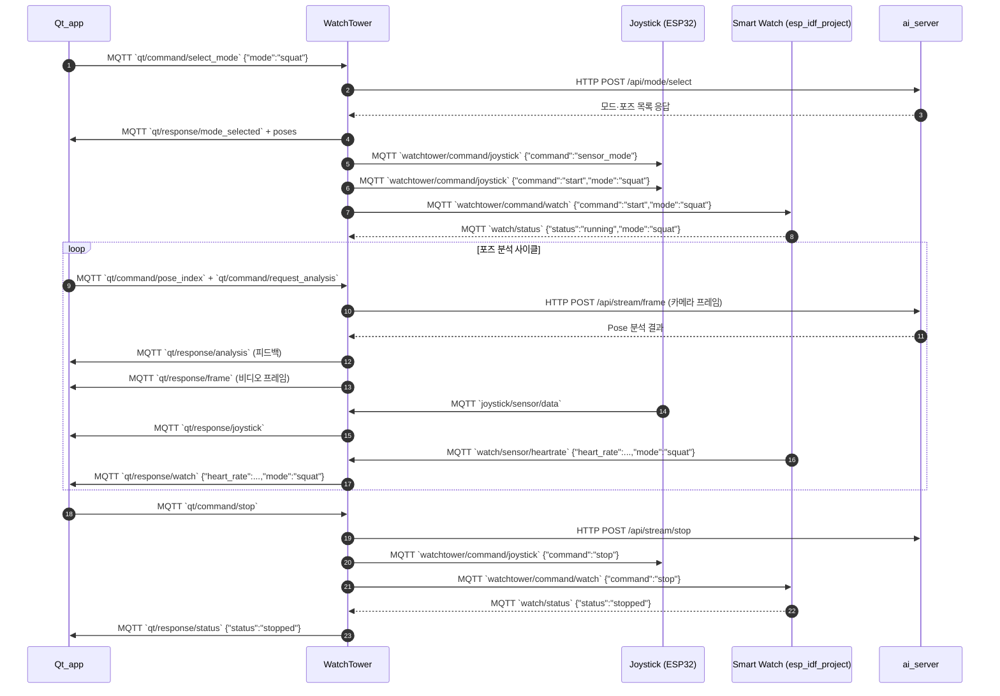

# 시스템 통합 프로토콜 안내

이 문서는 현재 레포지토리 기준으로 각 구성요소가 주고받는 MQTT/HTTP 메시지와 데이터 흐름을 설명합니다. Smart Watch(esp_idf_project) 구현 현황과 연동 시 주의사항을 포함합니다.

## 주요 구성요소

| 구성요소 | 경로 | 역할 |
|---------|------|------|
| Qt_app | `Qt_app/` | 사용자가 운동 모드를 선택하고 WatchTower 응답을 표시하는 Qt 기반 UI |
| WatchTower | `WatchTower/` | MQTT 허브이자 AI 서버·디바이스 중계. Qt 명령을 받아 조이스틱/워치를 제어하고 분석 결과를 재발행 |
| ai_server | `ai_server/` | Flask + YOLO Pose 분석 서버. 운동 모드/프레임을 입력받아 분석 피드백 반환 |
| mpu6050_mqtt | `mpu6050_mqtt/` | ESP32 조이스틱·에어마우스 장치. 동작 모드에 따라 센서 값 또는 마우스 좌표 발행 |
| esp_idf_project (Smart Watch) | `esp_idf_project/` | ESP32 기반 스마트워치. MAX30102 심박 센서, LVGL UI, Wi-Fi/MQTT 클라이언트로 심박 데이터 발행 |

## 통신 개요

- Qt_app은 운동 모드 제어 명령을 MQTT로 WatchTower에 전달하고, `qt/response/#` 토픽을 구독합니다.
- WatchTower는 Qt 명령을 수신해 AI 서버 HTTP API와 조이스틱·워치를 중계하며, 분석 결과 및 장치 데이터를 Qt에 재전송합니다.
- Joystick 장치는 WatchTower 명령에 따라 센서/에어마우스 모드로 전환하고 데이터를 발행합니다.
- Smart Watch는 Wi-Fi 연결 후 MQTT 브로커에 접속하지만 WatchTower의 `start` 명령을 받을 때까지 심박 측정을 시작하지 않습니다.
- AI 서버는 WatchTower의 HTTP 요청을 받아 운동 모드 구성과 프레임 분석을 처리합니다.

## MQTT 통신 요약

### Qt_app

| 방향 | 토픽 | 메시지 예시 |
|------|------|-------------|
| Publish | `qt/command/select_mode` | `{"mode":"squat","timestamp":1699999999}` |
| Publish | `qt/command/start` | `{"command":"start","mode":"squat","timestamp":1699999999}` |
| Publish | `qt/command/stop` | `{"command":"stop","timestamp":1699999999}` |
| Publish | `qt/command/pose_index` | `{"mode":"squat","pose_index":0,"timestamp":1699999999}` |
| Publish | `qt/command/request_analysis` | `{"mode":"squat","pose_index":0,"timestamp":1699999999}` |
| Publish | `watchtower/command/joystick` | `{"command":"airmouse_mode"}` / `{"command":"sensor_mode"}` / `{"command":"calibrate"}` |
| Subscribe | `qt/response/#` | WatchTower가 재발행하는 모든 응답 수신 |

`qt/response/#` 하위 토픽별 페이로드:

- `qt/response/mode_selected`: `{"mode":"squat","status":"success","message":"운동 시작","timestamp":...,"poses":[...],"total_poses":...}`
- `qt/response/analysis`: PoseAnalyzer 결과 (`status`, `score`, `feedback`, `is_correct`, `tracking`, `keypoints` 등)
- `qt/response/frame`: `{"frame":"<base64>","timestamp":...,"mode":"squat","pose_index":...}`
- `qt/response/status`: 상태 문자열
- `qt/response/error`: `{"message":"...", "error":"...", "timestamp":...}`
- `qt/response/joystick`: `{"source":"joystick", ...}` (에어마우스 데이터 또는 상태)
- `qt/response/watch`: `{"source":"watch", "heart_rate":75, "timestamp":...}` 또는 `{"source":"watch", "heartrate":75, ...}`

### WatchTower

| 방향 | 토픽 | 목적/비고 |
|------|------|-----------|
| Subscribe | `qt/command/select_mode`, `qt/command/start`, `qt/command/stop`, `qt/command/pose_index`, `qt/command/request_analysis` | Qt 명령 수신 |
| Subscribe | `joystick/sensor/data`, `joystick/status` | 조이스틱 데이터/상태 |
| Subscribe | `watch/sensor/heartrate`, `watch/status` | Watch 심박 데이터/상태 |
| Publish | `watchtower/command/joystick` | 조이스틱 start/stop/모드 전환/캘리브레이션 |
| Publish | `watchtower/command/watch` | 워치 start/stop/status 요청 명령 |
| Publish | `qt/response/*` | Qt용 응답 및 데이터 스트림 |

### mpu6050_mqtt (조이스틱)

| 방향 | 토픽 | 메시지 예시 |
|------|------|-------------|
| Publish | `joystick/sensor/data` | 센서 모드: `{"accel_x":0.01,"gyro_z":-0.12,"timestamp":...}` 에어마우스 모드: `{"mode":"airmouse","mouse_x":10.5,"mouse_y":-5.2,"scroll_delta":0,"button_pressed":false,"timestamp":...}` |
| Publish | `joystick/status` | `{"status":"ready","timestamp":...}` / `{"status":"stopped",...}` / `{"mode_change":"airmouse"}` |
| Subscribe | `watchtower/command/joystick` | `{"command":"start","mode":"squat"}` / `{"command":"stop"}` / `{"command":"airmouse_mode"}` 등 |

### Smart Watch (esp_idf_project)

- Wi-Fi가 IP를 획득하면 `watch_mqtt_client_init()`이 MQTT 클라이언트를 자동 시작하고, `watchtower/command/watch` 명령을 구독합니다.
- WatchTower의 `start` 명령이 들어오기 전까지 센서 태스크는 대기하며, 명령 수신 시 심박 센서 태스크를 시작하고 `watch/status`로 상태를 알립니다.
- MQTT 설정은 `menuconfig` > *Workout MQTT 설정*에서 조정합니다 (`CONFIG_WORKOUT_MQTT_*`).

| 방향 | 토픽 (기본값) | 메시지 예시 | 비고 |
|------|---------------|-------------|------|
| Publish | `CONFIG_WORKOUT_MQTT_TOPIC_HEART_RATE` (기본 `watch/sensor/heartrate`) | `{"device_id":"esp32-heart-rate","heart_rate":72,"timestamp":1699999999123,"mode":"squat"}` | 측정 활성화 시에만 발행, QoS=`CONFIG_WORKOUT_MQTT_QOS` |
| Publish | `CONFIG_WORKOUT_MQTT_TOPIC_STATUS` (기본 `watch/status`) | `{"device_id":"esp32-heart-rate","status":"running","mode":"squat","info":"start_command","timestamp":1699999999123}` | ready/running/stopped/error 등 상태 전파 |
| Subscribe | `CONFIG_WORKOUT_MQTT_TOPIC_COMMAND` (기본 `watchtower/command/watch`) | `{"command":"start","mode":"squat"}` / `{"command":"stop"}` / `{"command":"status"}` | start → 센서 시작, stop → 센서 중지, status → 상태 재전송 |

## HTTP 통신 (WatchTower ↔ ai_server)

| 메서드/엔드포인트 | 요청 본문 | 응답 본문 | 사용 위치 |
|-------------------|-----------|-----------|-----------|
| `POST /api/mode/select` | `{"mode":"squat"}` | 성공 시 `{"status":"success","message":"SQUAT mode selected","mode":"squat","poses":[...],"total_poses":...}` | `WatchTower/http_client.py:62` |
| `POST /api/stream/frame` | `{"frame":"<base64>","pose_index":0,"timestamp":...}` | PoseAnalyzer 결과 (`status`,`score`,`feedback`,`tracking`,`keypoints` 등) | `WatchTower/http_client.py:135`, `watchtower_main.py:333` |
| `POST /api/stream/stop` | `{"mode":"squat"}` | `{"status":"success","message":"Stream stopped","mode":"squat"}` | `watchtower_main.py:310` |
| `GET /api/health` | 없음 | `{"status":"healthy"}` | `WatchTower/http_client.py:25` |
| `GET /api/status` | 없음 | `{"status":"running","current_mode":...,"supported_modes":[...]}` | 선택적 모니터링용 |

## 시퀀스 다이어그램

## 참고 사항

- Smart Watch 프로젝트는 부팅 시 심박 센서를 초기화하지만 `watchtower/command/watch`의 `start` 명령이 도착할 때까지 측정을 시작하지 않습니다.
- 워치 펌웨어에서 발행하는 JSON 구조는 `watch_mqtt_client_publish_heart_rate()`를 수정하여 쉽게 변경 가능합니다. Qt/WatchTower와 동일한 키(`heart_rate`)를 사용하는 것이 권장됩니다.
- `watch/status` 토픽은 ready/running/stopped/error 상태를 통지하며 WatchTower의 `watch_ready` 플래그와 연동됩니다.
- 새로운 운동 모드를 추가할 경우 `ai_server/ai_config.py`, WatchTower 모드 매핑, Qt UI, 그리고 필요 시 장치 명령 세트를 모두 업데이트하세요.
