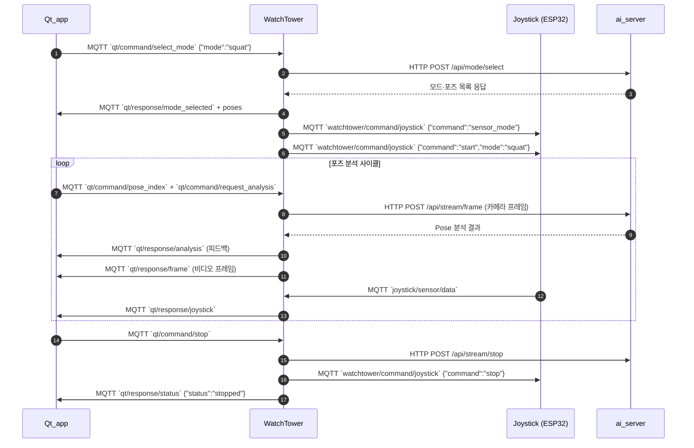

# 시스템 통합 프로토콜 안내

이 문서는 현재 코드 기준으로 각 구성요소가 교환하는 MQTT/HTTP 메시지와 데이터 흐름을 요약합니다.

## 주요 구성요소

| 구성요소 | 역할 |
|---------|------|
| Qt_app | 사용자 UI. 운동 선택, 시작/정지 명령 발행 및 WatchTower 응답 처리 |
| WatchTower | MQTT 브로커 클라이언트이자 중계 허브. AI 서버와 디바이스를 제어하고 Qt에 결과 전달 |
| ai_server | Flask 기반 YOLO Pose 분석 서버 |
| mpu6050_mqtt | ESP32 조이스틱·에어마우스 장치 |
| esp_idf_project (스마트워치) | 심박수 장치. 현재 토픽/페이로드 정비 필요 |

## MQTT 통신 요약

### Qt_app

| 방향 | 토픽 | 메시지 예시 |
|------|------|-------------|
| Publish | `qt/command/select_mode` | `{"mode":"squat","timestamp":1699999999}` |
| Publish | `qt/command/start` | `{"command":"start","mode":"squat","timestamp":1699999999}` |
| Publish | `qt/command/stop` | `{"command":"stop","timestamp":1699999999}` |
| Publish | `qt/command/pose_index` | `{"mode":"squat","pose_index":0,"timestamp":1699999999}` |
| Publish | `watchtower/command/joystick` | `{"command":"airmouse_mode"}` / `{"command":"sensor_mode"}` / `{"command":"calibrate"}` |
| Subscribe | `qt/response/#` | WatchTower가 재발행하는 모든 응답 수신 |

`qt/response/#` 하위 토픽별 페이로드:

- `qt/response/mode_selected`: `{"mode":"squat","status":"success","message":"운동 시작","timestamp":...,"poses":[...],"total_poses":...}`
- `qt/response/analysis`: PoseAnalyzer 결과 (`status`, `score`, `feedback`, `is_correct`, `tracking`, `keypoints` 등)
- `qt/response/frame`: `{"frame":"<base64>","timestamp":...,"mode":"squat","pose_index":...}`
- `qt/response/status`: 상태 문자열
- `qt/response/error`: `{"message":"...", "error":"...", "timestamp":...}`
- `qt/response/joystick`: `{"source":"joystick", ...}` (에어마우스 데이터 또는 상태)
- `qt/response/watch`: `{"source":"watch", "heart_rate":75, "timestamp":...}` (또는 `heartrate`)

#### 단일 분석 요청 메시지

- `qt/command/request_analysis`: `{"mode":"squat","pose_index":0,"timestamp":1699999999}`

### WatchTower

| 방향 | 토픽 | 목적 |
|------|------|------|
| Subscribe | `qt/command/select_mode`, `qt/command/start`, `qt/command/stop`, `qt/command/pose_index`, `qt/command/request_analysis` | Qt 명령 수신 |
| Subscribe | `joystick/sensor/data`, `joystick/status` | 조이스틱 데이터/상태 수집 |
| Subscribe | `watch/sensor/heartrate`, `watch/status` | 워치 데이터/상태 수집 |
| Publish | `watchtower/command/joystick` | 조이스틱 start/stop/모드 전환/캘리브레이션 |
| Publish | `watchtower/command/watch` | 워치 start/stop 명령 |
| Publish | `qt/response/*` | Qt용 응답 및 데이터 스트림 (위 표 참고) |

### mpu6050_mqtt (조이스틱)

| 방향 | 토픽 | 메시지 예시 |
|------|------|-------------|
| Publish | `joystick/sensor/data` | 센서 모드: `{"accel_x":0.01,"gyro_z":-0.12,"timestamp":...}` 에어마우스 모드: `{"mode":"airmouse","mouse_x":10.5,"mouse_y":-5.2,"scroll_delta":0,"button_pressed":false,"timestamp":...}` |
| Publish | `joystick/status` | `{"status":"ready","timestamp":...}` / `{"status":"stopped",...}` |
| Subscribe | `watchtower/command/joystick` | `{"command":"start","mode":"squat"}` / `{"command":"stop"}` / `{"command":"airmouse_mode"}` 등 |

### esp_idf_project (워치)

- **현재 코드 기준**: `watchtower/command/watch` 구독, `watch/status` 및 `watch/sensor/heartrate` 발행 로직 필요 (일부 미구현 상태).
- WatchTower가 기대하는 페이로드:
  - `watch/status`: `{"status":"ready","timestamp":...}`
  - `watch/sensor/heartrate`: `{"heart_rate":78,"timestamp":...}`

## HTTP 통신 (WatchTower ↔ ai_server)

| 메서드/엔드포인트 | 요청 본문 | 응답 본문 | 사용 위치 |
|-------------------|-----------|-----------|-----------|
| `POST /api/mode/select` | `{"mode":"squat"}` | 성공 시 `{"status":"success","message":"SQUAT mode selected","mode":"squat","poses":[...],"total_poses":...}` | `WatchTower/http_client.py:62` |
| `POST /api/stream/frame` | `{"frame":"<base64>","pose_index":0,"timestamp":...}` | PoseAnalyzer 결과 (`status`,`score`,`feedback`,`tracking`,`keypoints` 등) | `WatchTower/http_client.py:135` / `watchtower_main.py:333` |
| `POST /api/stream/stop` | `{"mode":"squat"}` | `{"status":"success","message":"Stream stopped","mode":"squat"}` | `watchtower_main.py:310` |
| `GET /api/health` | 없음 | `{"status":"healthy"}` | `WatchTower/http_client.py:25` |
| `GET /api/status` | 없음 | `{"status":"running","current_mode":...,"supported_modes":[...]}` | 옵션 |

## 시퀀스 다이어그램

## 참고 사항

- WatchTower는 조이스틱·워치 원본 토픽을 계속 구독하지만 Qt는 더 이상 직접 의존하지 않으며, `qt/response/joystick`/`watch`에 포함된 데이터만 사용합니다.
- WatchTower는 `qt/command/request_analysis` 요청이 있을 때에만 AI 서버로 프레임을 전송하여 분석합니다.
- 워치 장치는 `watch/sensor/heartrate` 페이로드를 `{"heart_rate":...}` 형태로 맞추는 것을 권장합니다 (Qt가 `heart_rate`와 `heartrate` 모두 수용하도록 구현되어 있음).
- 새로운 운동 모드를 추가하려면 `ai_server/ai_config.py`와 WatchTower/Qt 매핑 모두를 갱신해야 합니다.
