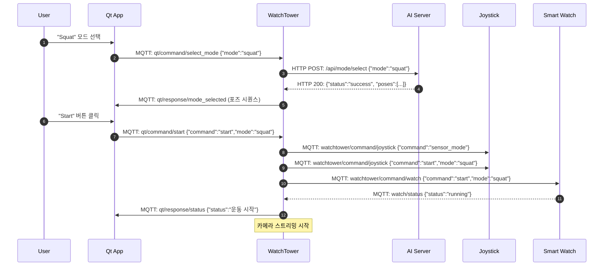
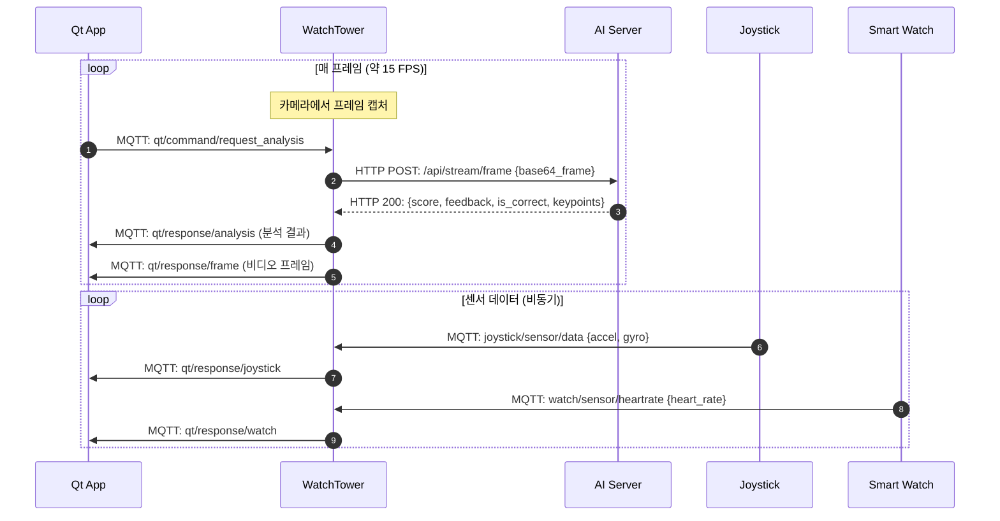
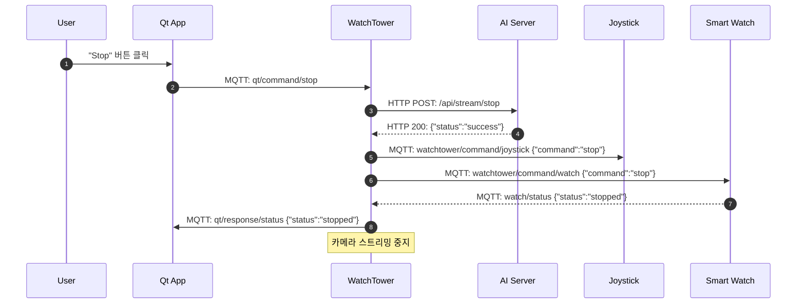

# 시스템 통합 프로토콜

이 문서는 **New Workout Plan** 프로젝트의 모든 컴포넌트 간 통신 프로토콜을 정의합니다.
MQTT 메시지 포맷, HTTP API 엔드포인트, 데이터 흐름 및 통신 시퀀스를 상세히 설명합니다.

## 목차

- [시스템 아키텍처](#시스템-아키텍처)
- [통신 프로토콜 개요](#통신-프로토콜-개요)
- [MQTT 통신](#mqtt-통신)
- [HTTP 통신](#http-통신)
- [UART 통신](#uart-통신)
- [시퀀스 다이어그램](#시퀀스-다이어그램)
- [에러 처리](#에러-처리)
- [확장 가이드](#확장-가이드)

---

## 시스템 아키텍처

### 컴포넌트 구성

| 컴포넌트 | 역할 | 통신 방식 |
|---------|------|---------|
| **Qt Application** | 사용자 인터페이스, 운동 모드 선택, 결과 표시 | MQTT Client |
| **WatchTower** | MQTT 브로커, 데이터 허브, 카메라 스트리밍 | MQTT Broker/Client, HTTP Client, UART |
| **AI Server** | YOLO Pose 분석, 자세 검증, 피드백 생성 | HTTP Server |
| **Smart Watch** | 심박수 측정 및 전송 | MQTT Client |
| **Joystick** | 센서 데이터 또는 에어마우스 입력 | MQTT Client |
| **STM32 (Pan-Tilt)** | 서보 모터 제어 | UART Slave |

### 네트워크 토폴로지

```
                    ┌─────────────────┐
                    │   AI Server     │
                    │  (Flask/HTTP)   │
                    └────────┬────────┘
                             │ HTTP/REST
                             │
                    ┌────────┴────────┐
                    │   WatchTower    │
                    │  (MQTT Broker)  │
                    │  (HTTP Client)  │
                    │  (UART Master)  │
                    └────┬────┬───┬───┘
                         │    │   │
             ┌───────────┘    │   └────────────┐
             │ MQTT           │ MQTT           │ UART
             │                │                │
    ┌────────┴────┐  ┌────────┴────┐  ┌───────┴──────┐
    │   Qt App    │  │ Smart Watch │  │    STM32     │
    └─────────────┘  │  Joystick   │  │  (Pan-Tilt)  │
                     └─────────────┘  └──────────────┘
```

---

## 통신 프로토콜 개요

### 프로토콜 선택 기준

| 통신 유형 | 프로토콜 | 이유 |
|----------|---------|------|
| IoT 디바이스 ↔ WatchTower | MQTT | 경량, 비동기, Pub/Sub, QoS 지원 |
| WatchTower ↔ AI Server | HTTP/REST | 요청/응답 패턴, 이미지 전송 |
| WatchTower ↔ STM32 | UART | 저수준 하드웨어 제어, 실시간성 |

### 데이터 포맷

- **MQTT**: JSON (UTF-8 인코딩)
- **HTTP**: JSON (요청/응답), Base64 (이미지)
- **UART**: 사용자 정의 바이너리 프로토콜

---

## MQTT 통신

### 브로커 설정

- **호스트**: WatchTower (Jetson Nano)
- **포트**: 1883 (기본 MQTT 포트)
- **프로토콜**: MQTT v3.1.1
- **QoS**: 기본 QoS 0 (Fire and Forget), 중요한 명령은 QoS 1

---

## Qt Application

### 발행 (Publish) 토픽

#### 1. 운동 모드 선택

**토픽**: `qt/command/select_mode`

**QoS**: 1

**페이로드**:
```json
{
  "mode": "squat",
  "timestamp": 1699999999123
}
```

**필드 설명**:
- `mode` (string): 선택된 운동 모드 (예: `"squat"`, `"lunge"`, `"barbell_routine"`)
- `timestamp` (number): Unix 타임스탬프 (밀리초)

**예시**:
```json
{
  "mode": "barbell_routine",
  "timestamp": 1699999999123
}
```

---

#### 2. 운동 시작

**토픽**: `qt/command/start`

**QoS**: 1

**페이로드**:
```json
{
  "command": "start",
  "mode": "squat",
  "timestamp": 1699999999123
}
```

**필드 설명**:
- `command` (string): `"start"`
- `mode` (string): 현재 운동 모드
- `timestamp` (number): Unix 타임스탬프 (밀리초)

---

#### 3. 운동 중지

**토픽**: `qt/command/stop`

**QoS**: 1

**페이로드**:
```json
{
  "command": "stop",
  "timestamp": 1699999999123
}
```

**필드 설명**:
- `command` (string): `"stop"`
- `timestamp` (number): Unix 타임스탬프 (밀리초)

---

#### 4. 포즈 인덱스 변경

**토픽**: `qt/command/pose_index`

**QoS**: 0

**페이로드**:
```json
{
  "mode": "squat",
  "pose_index": 1,
  "timestamp": 1699999999123
}
```

**필드 설명**:
- `mode` (string): 현재 운동 모드
- `pose_index` (number): 확인할 포즈 시퀀스 인덱스 (0부터 시작)
- `timestamp` (number): Unix 타임스탬프 (밀리초)

**사용 사례**: 사용자가 특정 포즈로 건너뛰기 또는 되돌아가기

---

#### 5. 분석 요청

**토픽**: `qt/command/request_analysis`

**QoS**: 0

**페이로드**:
```json
{
  "mode": "squat",
  "pose_index": 0,
  "timestamp": 1699999999123
}
```

**필드 설명**:
- `mode` (string): 현재 운동 모드
- `pose_index` (number): 현재 포즈 인덱스
- `timestamp` (number): Unix 타임스탬프 (밀리초)

**참고**: WatchTower는 이 메시지를 받으면 현재 카메라 프레임을 AI 서버로 전송하여 분석을 요청합니다.

---

#### 6. 조이스틱 제어

**토픽**: `watchtower/command/joystick`

**QoS**: 1

**페이로드**:

```json
// 에어마우스 모드로 전환
{
  "command": "airmouse_mode"
}

// 센서 모드로 전환
{
  "command": "sensor_mode"
}

// 캘리브레이션
{
  "command": "calibrate"
}
```

**필드 설명**:
- `command` (string): `"airmouse_mode"`, `"sensor_mode"`, `"calibrate"` 중 하나

---

### 구독 (Subscribe) 토픽

Qt Application은 `qt/response/#` 와일드카드를 구독하여 WatchTower로부터 모든 응답을 수신합니다.

#### 1. 모드 선택 응답

**토픽**: `qt/response/mode_selected`

**페이로드**:
```json
{
  "mode": "squat",
  "status": "success",
  "message": "운동 시작",
  "timestamp": 1699999999123,
  "poses": [
    {
      "name": "squat_stand",
      "description": "스쿼트 준비 자세 (선 자세)",
      "duration": 1.0
    },
    {
      "name": "squat_down",
      "description": "스쿼트 자세 (무릎 90도)",
      "duration": 2.0
    }
  ],
  "total_poses": 2
}
```

**필드 설명**:
- `mode` (string): 선택된 운동 모드
- `status` (string): `"success"` 또는 `"error"`
- `message` (string): 사용자 표시용 메시지
- `timestamp` (number): Unix 타임스탬프
- `poses` (array): 포즈 시퀀스 정보
  - `name` (string): 포즈 이름
  - `description` (string): 포즈 설명
  - `duration` (number): 권장 유지 시간 (초)
- `total_poses` (number): 전체 포즈 개수

---

#### 2. 자세 분석 결과

**토픽**: `qt/response/analysis`

**페이로드**:
```json
{
  "status": "success",
  "score": 85,
  "feedback": "스쿼트 자세가 정확합니다! 무릎이 발끝과 일직선입니다.",
  "is_correct": true,
  "current_pose": "squat_down",
  "pose_description": "스쿼트 자세 (무릎 90도)",
  "mode": "squat",
  "pose_index": 1,
  "timestamp": 1699999999123,
  "tracking": {
    "nose": {"x": 320, "y": 100, "confidence": 0.95},
    "left_shoulder": {"x": 280, "y": 180, "confidence": 0.92},
    "right_shoulder": {"x": 360, "y": 182, "confidence": 0.93}
    // ... 17개 키포인트
  },
  "keypoints": [
    [320, 100, 0.95],  // nose
    [295, 120, 0.88],  // left_eye
    // ... 17개 키포인트 배열
  ]
}
```

**필드 설명**:
- `status` (string): `"success"` 또는 `"error"`
- `score` (number): 자세 점수 (0-100)
- `feedback` (string): 사용자 피드백 메시지
- `is_correct` (boolean): 자세가 올바른지 여부
- `current_pose` (string): 현재 포즈 이름
- `pose_description` (string): 포즈 설명
- `mode` (string): 운동 모드
- `pose_index` (number): 현재 포즈 인덱스
- `timestamp` (number): Unix 타임스탬프
- `tracking` (object): 키포인트별 상세 정보 (선택사항)
- `keypoints` (array): YOLO Pose 키포인트 배열 [x, y, confidence] x 17

**YOLO Pose 키포인트 순서 (0-16)**:
```
0: nose
1: left_eye, 2: right_eye
3: left_ear, 4: right_ear
5: left_shoulder, 6: right_shoulder
7: left_elbow, 8: right_elbow
9: left_wrist, 10: right_wrist
11: left_hip, 12: right_hip
13: left_knee, 14: right_knee
15: left_ankle, 16: right_ankle
```

---

#### 3. 비디오 프레임

**토픽**: `qt/response/frame`

**페이로드**:
```json
{
  "frame": "<base64_encoded_image>",
  "timestamp": 1699999999123,
  "mode": "squat",
  "pose_index": 1
}
```

**필드 설명**:
- `frame` (string): Base64로 인코딩된 JPEG 이미지
- `timestamp` (number): Unix 타임스탬프
- `mode` (string): 현재 운동 모드
- `pose_index` (number): 현재 포즈 인덱스

**디코딩 예시 (Python)**:
```python
import base64
import cv2
import numpy as np

frame_data = json_data["frame"]
img_bytes = base64.b64decode(frame_data)
np_arr = np.frombuffer(img_bytes, np.uint8)
frame = cv2.imdecode(np_arr, cv2.IMREAD_COLOR)
```

---

#### 4. 시스템 상태

**토픽**: `qt/response/status`

**페이로드**:
```json
{
  "status": "running",
  "message": "운동 진행 중",
  "timestamp": 1699999999123
}
```

**가능한 상태**:
- `"idle"`: 대기 중
- `"running"`: 운동 진행 중
- `"stopped"`: 중지됨
- `"error"`: 오류 발생

---

#### 5. 에러 메시지

**토픽**: `qt/response/error`

**페이로드**:
```json
{
  "message": "AI 서버 연결 실패",
  "error": "Connection refused",
  "timestamp": 1699999999123
}
```

**필드 설명**:
- `message` (string): 사용자 친화적 에러 메시지
- `error` (string): 기술적 에러 상세 (선택사항)
- `timestamp` (number): Unix 타임스탬프

---

#### 6. 조이스틱 데이터

**토픽**: `qt/response/joystick`

**페이로드**:

```json
// 센서 모드
{
  "source": "joystick",
  "accel_x": 0.15,
  "accel_y": -0.02,
  "accel_z": 9.81,
  "gyro_x": 0.01,
  "gyro_y": -0.03,
  "gyro_z": 0.12,
  "timestamp": 1699999999123
}

// 에어마우스 모드
{
  "source": "joystick",
  "mode": "airmouse",
  "mouse_x": 10.5,
  "mouse_y": -5.2,
  "scroll_delta": 0,
  "button_pressed": false,
  "timestamp": 1699999999123
}
```

**필드 설명**:
- `source` (string): `"joystick"`
- **센서 모드**:
  - `accel_x/y/z` (number): 가속도 (m/s²)
  - `gyro_x/y/z` (number): 각속도 (rad/s)
- **에어마우스 모드**:
  - `mode` (string): `"airmouse"`
  - `mouse_x/y` (number): 상대 이동량 (픽셀)
  - `scroll_delta` (number): 스크롤 양
  - `button_pressed` (boolean): 버튼 클릭 여부
- `timestamp` (number): Unix 타임스탬프

---

#### 7. 심박수 데이터

**토픽**: `qt/response/watch`

**페이로드**:
```json
{
  "source": "watch",
  "heart_rate": 75,
  "mode": "squat",
  "timestamp": 1699999999123
}
```

**필드 설명**:
- `source` (string): `"watch"`
- `heart_rate` (number): 심박수 (BPM)
- `mode` (string): 현재 운동 모드 (선택사항)
- `timestamp` (number): Unix 타임스탬프

---

## WatchTower

WatchTower는 MQTT 브로커이자 클라이언트로 동작하며, Qt와 디바이스 간의 중계 역할을 수행합니다.

### 구독 (Subscribe) 토픽

| 토픽 | 발행자 | 목적 |
|------|-------|------|
| `qt/command/select_mode` | Qt App | 운동 모드 선택 |
| `qt/command/start` | Qt App | 운동 시작 |
| `qt/command/stop` | Qt App | 운동 중지 |
| `qt/command/pose_index` | Qt App | 포즈 인덱스 변경 |
| `qt/command/request_analysis` | Qt App | 분석 요청 |
| `joystick/sensor/data` | Joystick | 센서 데이터 |
| `joystick/status` | Joystick | 조이스틱 상태 |
| `watch/sensor/heartrate` | Smart Watch | 심박수 데이터 |
| `watch/status` | Smart Watch | 워치 상태 |

### 발행 (Publish) 토픽

| 토픽 | 구독자 | 목적 |
|------|-------|------|
| `watchtower/command/joystick` | Joystick | 조이스틱 제어 |
| `watchtower/command/watch` | Smart Watch | 워치 제어 |
| `qt/response/*` | Qt App | Qt 응답 (모든 하위 토픽) |

---

### 조이스틱 제어 명령

**토픽**: `watchtower/command/joystick`

**페이로드**:

```json
// 시작
{
  "command": "start",
  "mode": "squat"
}

// 중지
{
  "command": "stop"
}

// 에어마우스 모드
{
  "command": "airmouse_mode"
}

// 센서 모드
{
  "command": "sensor_mode"
}

// 캘리브레이션
{
  "command": "calibrate"
}
```

---

### 워치 제어 명령

**토픽**: `watchtower/command/watch`

**페이로드**:

```json
// 측정 시작
{
  "command": "start",
  "mode": "squat"
}

// 측정 중지
{
  "command": "stop"
}

// 상태 요청
{
  "command": "status"
}
```

---

## Smart Watch (ESP32)

### 발행 (Publish) 토픽

#### 1. 심박수 데이터

**토픽**: `watch/sensor/heartrate` (기본값, `menuconfig`에서 변경 가능)

**QoS**: 1 (기본값, `CONFIG_WORKOUT_MQTT_QOS`)

**발행 주기**: 심박 측정 활성화 시 실시간

**페이로드**:
```json
{
  "device_id": "esp32-heart-rate",
  "heart_rate": 72,
  "timestamp": 1699999999123,
  "mode": "squat"
}
```

**필드 설명**:
- `device_id` (string): 디바이스 ID (기본: `CONFIG_WORKOUT_MQTT_DEVICE_ID`)
- `heart_rate` (number): 심박수 (BPM)
- `timestamp` (number): Unix 타임스탬프 (밀리초)
- `mode` (string): 현재 운동 모드 (선택사항)

---

#### 2. 상태 메시지

**토픽**: `watch/status` (기본값)

**페이로드**:
```json
{
  "device_id": "esp32-heart-rate",
  "status": "running",
  "mode": "squat",
  "info": "start_command",
  "timestamp": 1699999999123
}
```

**필드 설명**:
- `device_id` (string): 디바이스 ID
- `status` (string): `"ready"`, `"running"`, `"stopped"`, `"error"` 중 하나
- `mode` (string): 현재 운동 모드 (선택사항)
- `info` (string): 추가 정보 (선택사항)
- `timestamp` (number): Unix 타임스탬프

**상태 전환**:
- `ready`: 부팅 완료, MQTT 연결 완료
- `running`: 심박 측정 활성화
- `stopped`: 측정 중지
- `error`: 센서 에러 또는 통신 실패

---

### 구독 (Subscribe) 토픽

**토픽**: `watchtower/command/watch` (기본값)

**수신 명령**:
```json
{
  "command": "start",
  "mode": "squat"
}
```

**명령 유형**:
- `"start"`: 심박 센서 측정 시작
- `"stop"`: 측정 중지
- `"status"`: 현재 상태 재전송

---

### 설정 (menuconfig)

ESP-IDF `menuconfig`에서 다음 항목을 설정할 수 있습니다:

```
Workout MQTT Configuration
  ├─ MQTT Broker URI: mqtt://192.168.x.x:1883
  ├─ Device ID: esp32-heart-rate
  ├─ Heart Rate Topic: watch/sensor/heartrate
  ├─ Status Topic: watch/status
  ├─ Command Topic: watchtower/command/watch
  └─ QoS Level: 0/1/2
```

---

## Joystick (ESP32)

### 발행 (Publish) 토픽

#### 1. 센서 데이터

**토픽**: `joystick/sensor/data`

**QoS**: 0

**페이로드**:

```json
// 센서 모드
{
  "accel_x": 0.15,
  "accel_y": -0.02,
  "accel_z": 9.81,
  "gyro_x": 0.01,
  "gyro_y": -0.03,
  "gyro_z": 0.12,
  "timestamp": 1699999999123
}

// 에어마우스 모드
{
  "mode": "airmouse",
  "mouse_x": 10.5,
  "mouse_y": -5.2,
  "scroll_delta": 0,
  "button_pressed": false,
  "timestamp": 1699999999123
}
```

---

#### 2. 상태 메시지

**토픽**: `joystick/status`

**페이로드**:
```json
{
  "status": "ready",
  "current_mode": "airmouse",
  "timestamp": 1699999999123
}
```

**상태 유형**:
- `"ready"`: 대기 중
- `"sensor_active"`: 센서 모드 활성
- `"airmouse_active"`: 에어마우스 모드 활성
- `"calibrating"`: 캘리브레이션 중
- `"stopped"`: 중지됨

---

### 구독 (Subscribe) 토픽

**토픽**: `watchtower/command/joystick`

**수신 명령**: (위 WatchTower 섹션 참조)

---

## HTTP 통신

WatchTower와 AI Server 간의 HTTP/REST API 통신

### AI Server 엔드포인트

**Base URL**: `http://<AI_Server_IP>:5000`

---

#### 1. 운동 모드 선택

**엔드포인트**: `POST /api/mode/select`

**요청**:
```json
{
  "mode": "squat"
}
```

**응답 (성공)**:
```json
{
  "status": "success",
  "message": "SQUAT mode selected",
  "mode": "squat",
  "poses": [
    {
      "name": "squat_stand",
      "description": "스쿼트 준비 자세 (선 자세)",
      "duration": 1.0
    },
    {
      "name": "squat_down",
      "description": "스쿼트 자세 (무릎 90도)",
      "duration": 2.0
    }
  ],
  "total_poses": 2
}
```

**응답 (실패)**:
```json
{
  "status": "error",
  "message": "Unsupported mode: invalid_mode",
  "supported_modes": ["squat", "lunge", "kettlebell_swing", ...]
}
```

**HTTP 상태 코드**:
- `200 OK`: 성공
- `400 Bad Request`: 잘못된 모드 또는 누락된 파라미터
- `500 Internal Server Error`: 서버 오류

---

#### 2. 프레임 분석

**엔드포인트**: `POST /api/stream/frame`

**요청**:
```json
{
  "frame": "<base64_encoded_image>",
  "pose_index": 1,
  "timestamp": 1699999999123
}
```

**필드 설명**:
- `frame` (string): Base64 인코딩된 JPEG 이미지
- `pose_index` (number): 현재 확인할 포즈 인덱스
- `timestamp` (number): Unix 타임스탬프 (선택사항)

**응답 (성공)**:
```json
{
  "status": "success",
  "is_correct": true,
  "score": 85,
  "feedback": "스쿼트 자세가 정확합니다!",
  "current_pose": "squat_down",
  "pose_description": "스쿼트 자세 (무릎 90도)",
  "tracking": {
    "nose": {"x": 320, "y": 100, "confidence": 0.95},
    "left_shoulder": {"x": 280, "y": 180, "confidence": 0.92}
    // ... 17개 키포인트
  },
  "keypoints": [
    [320, 100, 0.95],
    [295, 120, 0.88],
    // ... 17개 키포인트
  ]
}
```

**응답 (사람 미검출)**:
```json
{
  "status": "warning",
  "is_correct": false,
  "score": 0,
  "feedback": "사람이 감지되지 않았습니다. 카메라 앞으로 이동해주세요.",
  "tracking": null,
  "keypoints": null
}
```

**HTTP 상태 코드**:
- `200 OK`: 성공 (분석 완료)
- `400 Bad Request`: 잘못된 요청 (이미지 없음, 잘못된 포맷)
- `500 Internal Server Error`: 서버 오류

---

#### 3. 스트리밍 중지

**엔드포인트**: `POST /api/stream/stop`

**요청**:
```json
{
  "mode": "squat"
}
```

**응답**:
```json
{
  "status": "success",
  "message": "Stream stopped",
  "mode": "squat"
}
```

**HTTP 상태 코드**:
- `200 OK`: 성공

---

#### 4. 서버 헬스 체크

**엔드포인트**: `GET /api/health`

**요청**: 없음

**응답**:
```json
{
  "status": "healthy"
}
```

**HTTP 상태 코드**:
- `200 OK`: 서버 정상

---

#### 5. 서버 상태 조회

**엔드포인트**: `GET /api/status`

**요청**: 없음

**응답**:
```json
{
  "status": "running",
  "current_mode": "squat",
  "supported_modes": [
    "bodyweight_routine",
    "kettlebell_routine",
    "barbell_routine",
    "squat",
    "lunge",
    "kettlebell_swing",
    "kettlebell_deadlift",
    "barbell_row",
    "barbell_upright_row",
    "barbell_overhead_press",
    "barbell_biceps_curl",
    "barbell_reverse_curl"
  ]
}
```

**HTTP 상태 코드**:
- `200 OK`: 성공

---

## UART 통신

WatchTower (Jetson Nano) ↔ STM32 (Pan-Tilt) 간 시리얼 통신

### 프로토콜 설정

- **Baud Rate**: 115200
- **Data Bits**: 8
- **Parity**: None
- **Stop Bits**: 1
- **Flow Control**: None
- **포트**: `/dev/ttyUSB0` 또는 `/dev/ttyACM0` (Jetson)

### 명령 포맷

WatchTower → STM32로 전송하는 명령:

```
<pan_angle>,<tilt_angle>\n
```

**예시**:
```
90,45\n    # Pan 90도, Tilt 45도
120,30\n   # Pan 120도, Tilt 30도
```

**필드 설명**:
- `pan_angle` (number): Pan 각도 (0-180°)
- `tilt_angle` (number): Tilt 각도 (0-180°)
- 각 명령은 개행 문자(`\n`)로 종료

**Python 전송 예시**:
```python
import serial

ser = serial.Serial('/dev/ttyUSB0', 115200, timeout=1)
pan, tilt = 90, 45
command = f"{pan},{tilt}\n"
ser.write(command.encode('utf-8'))
```

**STM32 수신 예시** (C):
```c
char rx_buffer[32];
int pan, tilt;

// UART 수신
HAL_UART_Receive(&huart2, (uint8_t*)rx_buffer, sizeof(rx_buffer), 100);

// 파싱
if (sscanf(rx_buffer, "%d,%d", &pan, &tilt) == 2) {
    set_servo_angle(PAN_SERVO, pan);
    set_servo_angle(TILT_SERVO, tilt);
}
```

---

## 시퀀스 다이어그램

### 1. 운동 시작 시퀀스



### 2. 실시간 분석 사이클



### 3. 운동 종료 시퀀스



---

## 에러 처리

### MQTT 연결 실패

**디바이스 (ESP32)**:
- 재연결 시도 (최대 5회, 5초 간격)
- 실패 시 Wi-Fi 재연결
- 로그: `ESP_LOGE(TAG, "MQTT connection failed")`

**WatchTower**:
- Mosquitto 서비스 상태 확인
- 재시작 시도
- Qt로 에러 메시지 전송: `qt/response/error`

### HTTP 요청 실패

**WatchTower → AI Server**:
- 재시도 (최대 3회, 1초 간격)
- 타임아웃: 10초
- 실패 시 Qt로 에러 전송:
  ```json
  {
    "message": "AI 서버 연결 실패",
    "error": "Connection timeout",
    "timestamp": 1699999999123
  }
  ```

### UART 통신 실패

**WatchTower → STM32**:
- 포트 재연결 시도
- 로그 출력
- 팬-틸트 기능 비활성화 (운동은 계속 진행)

---

## 확장 가이드

### 새로운 운동 모드 추가

1. **AI 서버** ([`ai_server_v3/ai_config.py`](ai_server_v3/ai_config.py)):
   ```python
   SUPPORTED_MODES = [
       # ... 기존 모드
       'new_exercise',  # 추가
   ]

   MODE_POSES = {
       'new_exercise': [
           {'name': 'pose1', 'description': '...', 'duration': 1.0},
           {'name': 'pose2', 'description': '...', 'duration': 2.0}
       ]
   }
   ```

2. **PoseAnalyzer** ([`ai_server_v3/pose_analyzer.py`](ai_server_v3/pose_analyzer.py)):
   - `analyze_pose()` 메서드에 새로운 포즈 검증 로직 추가

3. **Qt 앱**:
   - UI에 새로운 모드 버튼 추가
   - `select_mode()` 호출 시 `"new_exercise"` 전달

4. **이 문서 업데이트**:
   - [지원 운동 모드](#지원-운동-모드) 섹션에 추가

### 새로운 센서 추가

1. **ESP32 펌웨어**:
   - 새로운 센서 드라이버 구현
   - MQTT 발행 함수 작성

2. **MQTT 토픽 정의**:
   - 예: `device_name/sensor/data`

3. **WatchTower**:
   - 새로운 토픽 구독
   - 콜백 함수 등록
   - Qt로 데이터 중계

4. **Qt 앱**:
   - `qt/response/new_sensor` 구독
   - UI에 데이터 표시

5. **이 문서 업데이트**:
   - MQTT 섹션에 새로운 토픽 추가

---

## 참고 자료

### MQTT 토픽 네이밍 규칙

- **소문자 사용**: `qt/command/start` (O), `Qt/Command/Start` (X)
- **슬래시 구분**: 계층적 구조 (예: `device/type/action`)
- **와일드카드**:
  - `+`: 단일 레벨 (예: `qt/command/+`)
  - `#`: 모든 하위 레벨 (예: `qt/response/#`)

### JSON 스키마 검증

프로덕션 환경에서는 JSON 스키마 검증 라이브러리 사용 권장:
- Python: `jsonschema`
- C/C++: `nlohmann/json` with validation

### QoS 레벨 선택 기준

- **QoS 0**: 센서 데이터 (손실 허용)
- **QoS 1**: 명령 (중복 허용, 손실 불가)
- **QoS 2**: 중요한 명령 (중복/손실 불가, 성능 저하)

---

## 버전 히스토리

| 버전 | 날짜 | 변경 사항 |
|-----|------|----------|
| 1.0 | 2025-10-23 | 초기 프로토콜 문서 작성 |

---

**문서 작성자**: New Workout Plan Team
**마지막 업데이트**: 2025-10-23
**문의**: [GitHub Issues](https://github.com/uniljetstream/New_Workout_Plan/issues)
